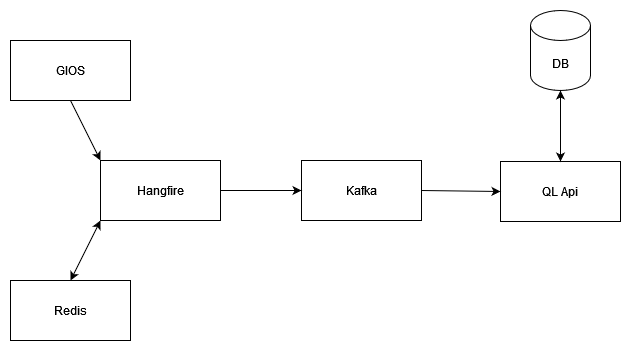
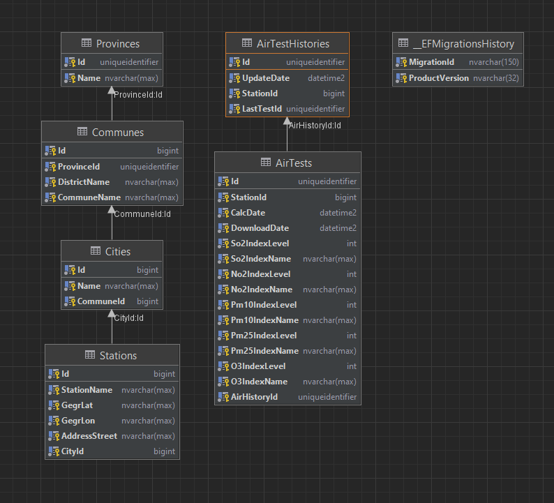

I wrote **QLApi** to learn myself with an interesting solution which is **GraphQL**.
seems to be an interesting alternative to **REST**.


## Architecture



The architecture consists of several parts
- **GIOS** provides the **REST api** to retrieve information about air monitoring stations, and the measurement results themselves
- **Hangire** queries **GIOS Api** for measurement results, stations and station locations, and put this to **Kafka**
- **Redis** stores information about all air monitoring stations
- **QL Api** collects all the information from **Hangfire** and puts it in to the database, also exposes an endpoint **Graph QL** that allows you to retrieve information about stations and their tests

<hr style="height:2px; background-color:gray;">

## Docker

```docker
version: '2'
services:
  
  zookeeper:
    image: wurstmeister/zookeeper
    hostname: zookeeper
    container_name: zookeeper
    ports:
      - "2181:2181"
  
  kafka:
    image: wurstmeister/kafka
    hostname: broker
    container_name: broker
    ports:
      - "9092:9092"
    environment:
      KAFKA_ADVERTISED_HOST_NAME: 127.0.0.1
      KAFKA_CREATE_TOPICS: "simpletalk_topic:1:1"
      KAFKA_ZOOKEEPER_CONNECT: zookeeper:2181
    volumes:
      - /var/run/docker.sock:/var/run/docker.sock
        
  redis:
    image: redis
    hostname: redis
    container_name: redis
    ports:
      - "6379:6379"
        
  database:
    image: mcr.microsoft.com/mssql/server:2019-latest
    container_name: ms-sql
    ports:
      - "1433:1433"
    environment:
      - ACCEPT_EULA=Y
      # user: sa
      - SA_PASSWORD=@Qwert123456789
      - MSSQL_PID=Developer
```
<hr style="height:2px; background-color:gray;">

## DB Structure



Application domain divided into two contexts
- **Province** is the exact location of the air testing station
- **AirTestHistory** the measurement results for each station

<hr style="height:2px; background-color:gray;">

## Hangfire 

Retrieves information about air monitoring stations from the county, for this using the Gios REST Api. <br />
Every hour, they read the air measurements from all the stations, and they send this result, to message broker **Kafka**.
**Redis** helps store the identifiers of all the air control stations

### GIOS API:

```js
GET https://api.gios.gov.pl/pjp-api/rest/station/findAll
```

```json
[
    ...
{
    "id": 16613,
    "stationName": "Nowa Sól",
    "gegrLat": "51.809103",
    "gegrLon": "15.708042",
    "city": {
      "id": 605,
      "name": "Nowa Sól",
      "commune": {
        "communeName": "Nowa Sól",
        "districtName": "nowosolski",
        "provinceName": "LUBUSKIE"
      }
    },
    "addressStreet": "T. Kościuszki"
  },

  ...
]
```

```js
GET https://api.gios.gov.pl/pjp-api/rest/aqindex/getIndex/{id}
```

```json
{
  "id": 52,
  "stCalcDate": "2021-12-19 23:20:17",
  "stIndexLevel": {
    "id": 0,
    "indexLevelName": "Bardzo dobry"
  },
  "stSourceDataDate": "2021-12-19 23:00:00",
  "so2CalcDate": "2021-12-19 23:20:17",
  "so2IndexLevel": {
    "id": 0,
    "indexLevelName": "Bardzo dobry"
  },
  ...
}
```
<br />

### Redis:

```c#
services.AddDistributedRedisCache(option =>
{
    option.Configuration = configuration.GetValue<string>("Redis:Configuration");
    option.InstanceName = configuration.GetValue<string>("Redis:InstanceName");
});
services.AddScoped<IRedisService, RedisService>();
```

When downloading data from all stations, it is stored in **Redis** .
That looks the basic information about the inspection stations

```c#
public async Task SaveAllStations(IList<Station> stations)
{
    var allStations = stations
        .Select(n => new Application.Models.Redis.Station
        {
            Id = n.Id,
            GegrLat = n.GegrLat,
            GegrLon = n.GegrLon,
            StationName = n.StationName,
            City = n.City.Name,
            Province = n.City.Commune.ProvinceName
        })
        .ToList();

    var stationSerialize = JsonConvert.SerializeObject(allStations);
    var stationToByte = Encoding.ASCII.GetBytes(stationSerialize);
    await _distributedCache.SetAsync(VariableKey, stationToByte);
}
```

When I want to download station measurements, I pull station information from **Redis**.

```c#
public async Task<IList<Application.Models.Redis.Station>> GetAllStations()
{
    var stationsToByte = await _distributedCache.GetAsync(VariableKey);
    if (stationsToByte == null)
        return new List<Application.Models.Redis.Station>();

    var result = JsonConvert
                     .DeserializeObject<List<Application.Models.Redis.Station>>(
                         Encoding.ASCII.GetString(stationsToByte));
    return result;
}
```

### Kafka:

I send two types of messages to **Kafka**, they look like this

```c#
public class AddProvinceCommand : INotification
{
    public ProvinceDto Province { get; set; }
}

public class AddStationStateCommand : INotification
{
    public AirTestDto AirTest { get; set; }
}
```

```c#
    var serialisedMessage = JsonConvert.SerializeObject(msg);
    var messageType = msg.GetType().Name;
    var producedMessage = new Message<string, string>
    {
        Key = key,
        Value = serialisedMessage,
        Headers = new Headers {{"message-type", Encoding.UTF8.GetBytes(messageType)}}
    };
    await _producer.Value.ProduceAsync("simpletalk_topic", producedMessage);
```

<hr style="height:2px; background-color:gray;">

## QL Api

Retrieves information about of the stations and their measurement results. <br />
It puts it all in the database. With endpoint, we have access to this data.

### Kafka:

We download the **AddStationStateCommand** and **AddProvinceCommand** commands and, using
mediation we perform operations on the domain.

```c#
while (!stoppingToken.IsCancellationRequested)
{
    try
    {
        var msg = consumer.Consume(cts.Token);
        var msgTypeEncoded = msg.Message.Headers.GetLastBytes("message-type");
        var msgTypeHeader = Encoding.UTF8.GetString(msgTypeEncoded);
        var msgType = applicationAssembly.GetType($"Application.Handlers.Commands.{msgTypeHeader}");
        
        var msgNotification = JsonConvert.DeserializeObject(msg.Message.Value, msgType);
        if (msgNotification != null)
            _mediator.Publish(msgNotification, stoppingToken).GetAwaiter().GetResult();
    }
    catch (OperationCanceledException) { }
}
```

### GraphQL

Api **Ql** is more or less like this

```js
###
POST http://localhost:5288/graphql
Content-Type: application/json

{
  "query": "query { provinces { list { name, id, communes { districtName, citys { name } } } } }"
}

###
POST http://localhost:5288/graphql
Content-Type: application/json

{
  "query": "query { provinces { province(id: \"20DC3C95-CED4-45C1-9542-50E3611FBCCF\") { name, id, communes { districtName, citys { name } } } } }"
}


###
POST http://localhost:5288/graphql
Content-Type: application/json

{
  "query": "query { airHistory { list { stationId, updateDate, airTests { so2IndexLevel } } } }"
}

###
POST http://localhost:5288/graphql
Content-Type: application/json

{
  "query": "query { airHistory { station(id: 584) { updateDate, airTests { so2IndexLevel } } } }"
}
```

The result is standard JSON

```json
HTTP/1.1 200 OK
Content-Type: application/json
Date: Tue, 11 Jan 2022 10:46:18 GMT
Server: Kestrel
Transfer-Encoding: chunked
X-GraphQL-AspNet-Server: v0.9.1.0

{
  "data": {
    "airHistory": {
      "station": {
        "updateDate": "2022-01-10T15:06:40.461+01:00",
        "airTests": [
          {
            "so2IndexLevel": 2147483647
          },
          {
            "so2IndexLevel": 2147483647
          },
```

For GrapQL I used the package 
```xml
<PackageReference Include="GraphQL.AspNet" Version="0.9.1-beta" />
```

As you can see, it's still **beta**, but it's a pretty cool way to create query patterns

```c#
[GraphRoute("airHistory")]
public class AirHistoryController : GraphController
{
    private readonly IMediator _mediator;

    public AirHistoryController(IMediator mediator)
    {
        _mediator = mediator;
    }

    [Query("list")]
    public async Task<IEnumerable<AirTestHistoryDto>> GetAllAirHistory()
    {
        var result = await _mediator.Send(new GetAllAirHistoryQuery());
        return result;
    }
    
    [Query("station")]
    public async Task<AirTestHistoryDto> GetStationTestHistory(long id)
    {
        var result = await _mediator.Send(new GetStationTestHistoryQuery {Id = id});
        return result;
    }
}
```